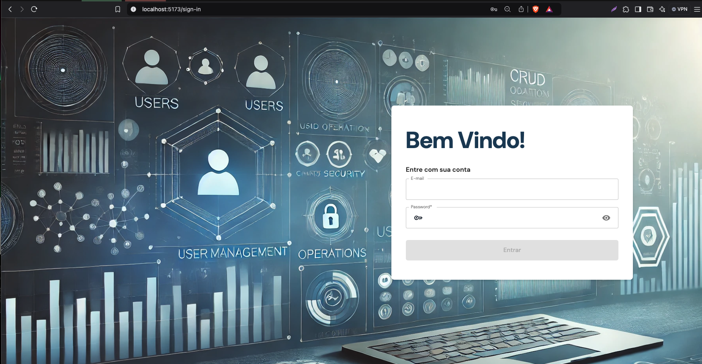
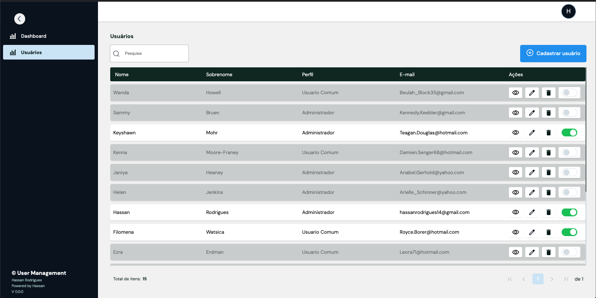
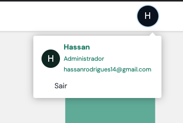

# user-trackr-api-nestjs-react

## Índice

- [user-trackr-api-nestjs-react](#user-trackr-api-nestjs-react)
  - [Índice](#índice)
  - [Projeto](#projeto)
  - [Descrição do Projeto](#descrição-do-projeto)
  - [Pré-requisitos](#pré-requisitos)
  - [Executando o Projeto (para quem deseja apenas rodar)](#executando-o-projeto-para-quem-deseja-apenas-rodar)
  - [Configurando para Desenvolvimento (para quem quer atuar no projeto)](#configurando-para-desenvolvimento-para-quem-quer-atuar-no-projeto)
    - [Configuração do Frontend](#configuração-do-frontend)
  - [Banco de Dados (PostgreSQL)](#banco-de-dados-postgresql)
  - [Front Prints](#front-prints)
      - [Tela Login](#tela-login)
      - [Tela usuário](#tela-usuário)
      - [Tela Dashboard](#tela-dashboard)
      - [Outras Imagens](#outras-imagens)
- [Erros Comuns ao Executar `docker-compose up -d`](#erros-comuns-ao-executar-docker-compose-up--d)
  - [1. `ERROR: for <service> Cannot create container for service <service>: Conflict. The container name "<name>" is already in use.`](#1-error-for-service-cannot-create-container-for-service-service-conflict-the-container-name-name-is-already-in-use)
    - [Causa:](#causa)
    - [Solução:](#solução)
  - [2. `ERROR: for <service> Cannot connect to the Docker daemon at unix:///var/run/docker.sock. Is the docker daemon running?`](#2-error-for-service-cannot-connect-to-the-docker-daemon-at-unixvarrundockersock-is-the-docker-daemon-running)
    - [Causa:](#causa-1)
    - [Solução:](#solução-1)
  - [3. `ERROR: Incomplete configuration for service '<service>'`](#3-error-incomplete-configuration-for-service-service)
    - [Causa:](#causa-2)
    - [Solução:](#solução-2)
  - [Considerações Finais](#considerações-finais)

---

## Projeto

Este repositório contém um projeto com arquitetura de frontend e backend, utilizando Docker para simplificar a configuração e execução dos serviços. O backend é desenvolvido com Nest.js e TypeORM para gerenciar as migrações do banco de dados, enquanto o frontend possui um ambiente isolado em Docker.

## Descrição do Projeto

Este projeto é uma aplicação web que conecta um frontend a um backend. O backend gerencia a lógica de negócios e a interação com o banco de dados, enquanto o frontend oferece uma interface de usuário amigável. O uso do Docker permite que todos os desenvolvedores trabalhem em um ambiente consistente, evitando problemas de configuração.

## Pré-requisitos

Para rodar este projeto, você precisará dos seguintes softwares instalados:

- [Git](https://git-scm.com/downloads)
- [Docker](https://docs.docker.com/get-docker/)
- [Docker Compose](https://docs.docker.com/compose/install/) (geralmente incluído na instalação do Docker)

---

## Executando o Projeto (para quem deseja apenas rodar)

Para rodar o projeto completo (frontend e backend) usando Docker, siga estas instruções:

1. Clone o repositório:

   ```bash
   git clone https://github.com/hassanrodrigues/user-trackr-api-nestjs-react.git
   cd user-trackr-api-nestjs-react

2.	Inicie os contêineres:

     ```bash
     docker-compose up -d
     ou
     docker compose up -d
3.	Acesse o backend no endereço http://localhost:3002/swagger e o frontend no endereço http://localhost:3000.

4. Credenciais
    ```bash
    email= hassanrodrigues14@gmail.com
    senha=123456
    ou 
    email=outrousarioExistente
    senha=User@ano(User@2024)
5. Para encerrar os contêineres, use:
   ```bash
   docker-compose down
   docker compose down

## Configurando para Desenvolvimento (para quem quer atuar no projeto)
1. Clone o repositório:
    ```bash
    git clone https://github.com/hassanrodrigues/user-trackr-api-nestjs-react.git
      cd user-trackr-api-nestjs-react
2.	Instale as dependências do backend:
      ```bash
         cd backend
         npm install
         ou
         pnpm install
3. Crie um arquivo .env na pasta backend e configure as variáveis de ambiente, com base no .env.example
4.	Inicie o Docker Compose para os serviços de banco de dados:
      ```bash
      docker-compose up -d database
5. Inicie o servidor de desenvolvimento do backend: 
  	1.	Instale as dependências do frontend:
   npm run start:dev
   ou
   pnpm run start:dev
### Configuração do Frontend
1. Instale as dependências do frontend:
   ```bash
   cd frontend
   yarn install
   ou 
   npm install
2.  Inicie o servidor de desenvolvimento do frontend:
      ```bash
      yarn run dev
      ou
      npm run dev
## Banco de Dados (PostgreSQL)
Este projeto utiliza PostgreSQL como banco de dados. Ao rodar o backend, será feito as migrations e seed de um usuário padrão, com as credenciais citadas acima.

## Front Prints
#### Tela Login

#### Tela usuário

#### Tela Dashboard

#### Outras Imagens



# Erros Comuns ao Executar `docker-compose up -d`

Alguns erros comuns que podem ocorrer ao executar `docker-compose up -d`, especialmente em um ambiente que utiliza NestJS e TypeORM.

## 1. `ERROR: for <service> Cannot create container for service <service>: Conflict. The container name "<name>" is already in use.`

### Causa:
Este erro ocorre quando você tenta criar um container que já existe com o mesmo nome.

### Solução:
- Verifique se o container já está em execução com `docker ps -a`.
- Remova o container existente usando `docker rm <container_name>` ou `docker-compose down` para parar e remover todos os containers.
  
## 2. `ERROR: for <service> Cannot connect to the Docker daemon at unix:///var/run/docker.sock. Is the docker daemon running?`

### Causa:
Esse erro indica que o cliente Docker não consegue se conectar ao daemon do Docker.

### Solução:
- Verifique se o daemon do Docker está em execução. Você pode reiniciar o serviço Docker com `sudo systemctl start docker` (Linux) ou reiniciar o Docker Desktop (Windows/Mac).
- Verifique as permissões de acesso ao socket do Docker.

## 3. `ERROR: Incomplete configuration for service '<service>'`

### Causa:
Este erro acontece quando um serviço no `docker-compose.yml` não possui todas as configurações necessárias.

### Solução:
- Verifique se todos os campos obrigatórios estão preenchidos para o serviço especificado.
- Consulte a documentação do Docker Compose para detalhes sobre as configurações exigidas.

## Considerações Finais

Se você encontrar outros erros não listados aqui, consulte os logs do Docker usando `docker-compose logs` para obter mais detalhes sobre o que pode estar errado.
   